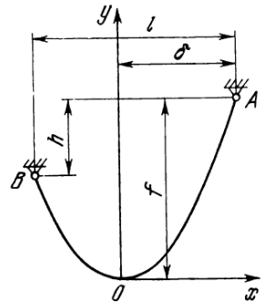
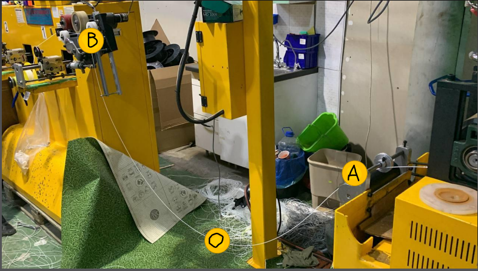
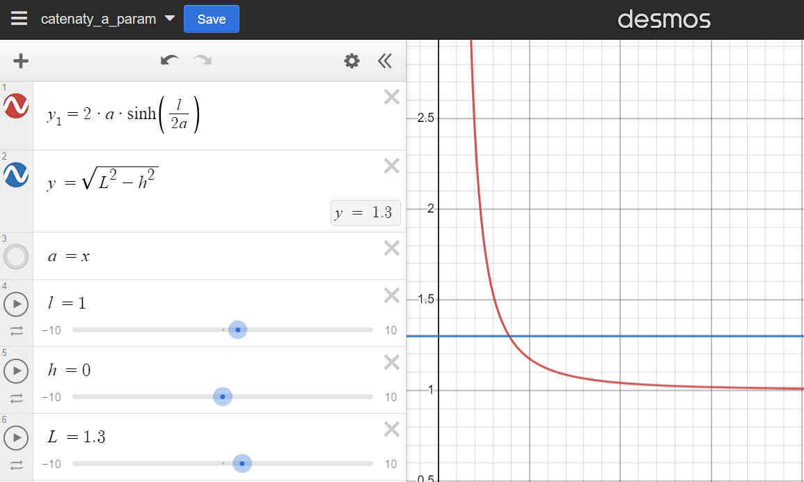

# Математика цепной линии

**Источники**
[1] [Статья на Хабре](https://habr.com/ru/articles/554414/)

[2] Введение в механику гибкой нити Меркин Д. Е. 1980

[3] [2-я часть оригинала статьи с Хабра](https://www.alanzucconi.com/2020/12/13/catenary-2/)

## Определение

*Цепная линия* - линия равновесия абсолютно гибкой нерастяжимой однородной нити, находящийся в поле силы тяжести.

Или проще подвесили нить за два конца, она приняла форму *цепной линии*. Остальное детали математической модели

> Soft filament мягкий, нить растяжима!
> [2] п 2.3 вывод о том, что условие растяжимости пренебрежимо мало

Рис 1. Цепная линия

$f$ - *стрела провисания* - расстояние по вертикали от вершины `O` до верхней точки опоры `A`
$\delta$ - расстояние по горизонтали от вершины `O` до верхней точки опоры `A`

Рис 2 Установка

## Основное уравнение

$$y = a cosh(x/a) \tag{1}$$

$a$ - параметр характеризует свойства нити, а именно, отношение сил в продольном направлении к удельному весу. Находим его и задача нахождения длины тривиальна 

## Несимметричные точки опоры

$$y = a cosh(\frac{x-p}{a}) + q \tag{2}$$

Параметры $p$ и $q$ позволяют строить цепную линию на несимметричных точках опоры

Точки опоры:
$$A(x_2; y_2)$$
$$B(x_1; y_1)$$

Расстояния между точками, см Рис 1 
$$h = y_2 - y_1$$
$$l = x_2 - x_1$$

**Параметры несимметричных точек опоры**

$$p = \frac{x_1+x_2-a \; ln{(\frac{L+h}{L-h}})}{2} \tag{3}$$

$$q = \frac{y_1 + y_2 - L\; coth{(\frac{l}{2a}})}{2} \tag{4}$$

$coth\; x = \frac{cosh\; x}{sin\; x}$ -  гиперболический котангенс

**Уравнение для параметра a**

$$\sqrt{L^2 - h^2} = 2a \; sinh{(\frac{l}{2a})} \tag{5}$$

[Решение с math.stackexchange](https://math.stackexchange.com/questions/1000447/finding-the-catenary-curve-with-given-arclength-through-two-given-points)

## Системы уравнений

Из нашего подхода с датчиком считаем, что нам известна одна произвольная точка на линии $M(x; y)$

> Надо продумать, как ввести систему координат:
> - с точками опоры `A`, `B`
> - с вершиной `O`
> - с известной точкой `M`

### Симметричные точки опоры

Условие симметрии:
$h = 0$ - опоры на одном уровне
$\delta = l/2$ - вершина `O` ровно посередине между опорами

Надо измерять:
$M(x; y)$ - произвольная точка на линии (показания дальномера + координата установки)
$l$ - расстояние по горизонтали между точками опоры

$$y = a \; cosh(x/a) \tag{1}$$

Пусть измеряем y в вершине, т.е. известна $M(x=0; y)$, получим

$a = y$ - по сути расстояние по вертикали до вершины

> Если нет - надо искать численное решение уравнения (1)
> или упражняться в математике в [2] есть неплохие примеры

$$\sqrt{L^2 - h^2} = 2a \; sinh{(\frac{l}{2a})} \tag{5}$$

при $h = 0$ упрощается до

$$L = 2a \; sinh{(\frac{l}{2a})}$$

### Несимметричные точки опоры

Не хватило времени, навскидку надо знать координаты точек опоры и решать систему из 2-3 трансцендентных уравнений.
