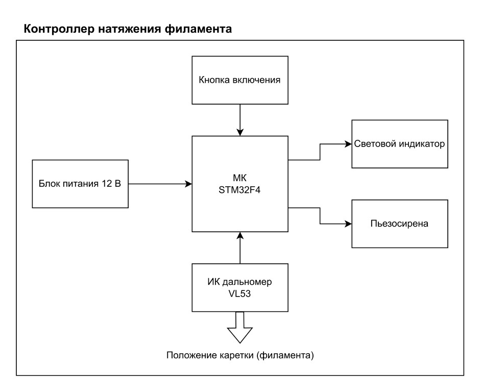
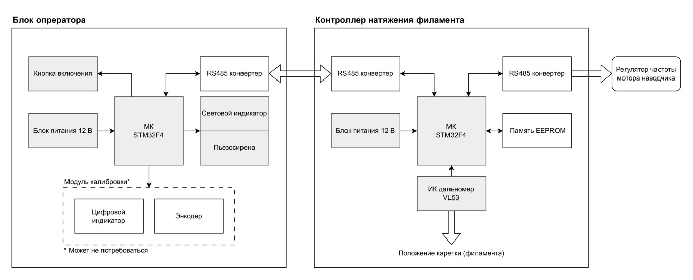

# Контроллер натяжения филамента

Устройство предназначено для установки в линию по производству филамента для 3D принтеров.

Контроллер может работать в режиме оповещения и в режиме управления.

В режиме **оповещения** Контроллер отслеживает положение каретки, которая прилегает к филаменту. При подъеме каретки выше определенного уровня Контроллер активирует световой и звуковой индикатор, предупреждая оператора о риске критического натяжения филамента. Уровень задается при установке контроллера в линию.

В режиме **управления** Контроллер управляет скоростью вращения вала намотчика. Управляющий сигнал подается на вход регулятора частоты намотчика по одному из доступных интерфейсов (RS485). Управляющий сигнал рассчитывается на основе измерений положения каретки.

Функции:
1. Контроль положения нити на участке провисания филамента
2. Оповещение оператора о критическом натяжении филамента
3. Измерение разности скоростей вращения валов намотчика и цилиндра на выходе из экструдера
4. Управление регулятором частоты двигателя намотчика
5. Подстройка скорости после смены катушки на намотчике

Требования:
1. Конструкция крепления предусматривает возможность убрать контроллер натяжения из линии производства
2. Управляющие элементы должны быть расположены на рабочей панели оператора
3. Простота эксплуатации
4. Быстро изнашивающиеся элементы конструкции могут быть напечатаны на 3D принтере
5. Конструкция устойчива к спутыванию филамента в результате смены катушки намотчика

Процесс разработки устройства разделен на три этапа в целях упростить и ускорить разработку

## Этап 1. Макет

Цели:
1. Проверить корпус Контроллера на прочность
2. Определиться с положением Контроллера в линии
3. Оценить ресурсоемкость решения задачи расчета разницы скоростей
4. Сбор данных о динамике положения филамента для проверки адекватности модели управления намотчиком

Структурная схема макета

В результате должны быть реализованы:
  - Функции:
    - п.1 Контроль положения нити на участке провисания филамента
    - п.3 Измерение разности скоростей вращения валов намотчика и цилиндра на выходе из экструдера. Может быть реализовано на ПК
 - Требования:
    - п.1 Конструкция крепления предусматривает возможность убрать контроллер натяжения из линии производства
    - п.4 Элементы быстро изнашивающиеся элементы конструкции могут быть напечатаны на 3D принтере
    - п.5 Устойчивость к ситуации спутывания филамента при смене катушки намотчика

Перед установкой Контроллера в линию должна быть проверена прочность корпуса.

Сбор данных о динамике нити может потребовать подключение Контроллера к ПК через внешний USB-UART преобразователь. Эти данные нужны, чтобы оценить адекватность модели, которая используется для разработки алгоритма управления намотчиком.

После доработок в конструкционной части и при условии положительной оценки реализуемости алгоритма на выбранном микроконтроллере можно переходить к этапу 2.

## Этап 2. Прототип

Цели:
1. Ввод в эксплуатацию в режиме оповещения
2. Испытать управление оборотами двигателя намотчика

Серые прямоугольники на схеме - компоненты, драйвера которых были отлажены в макете

Структурная схема прототипа

В результате должны быть выполнены:
- Функции:
  - п.2 Оповещение оператора о критическом натяжении филамента
  - п.4 Управление регулятором частоты двигателя намотчика
  - п.5 Подстройка скорости после смены катушки на намотчике

Требования:
  - п.2 Управляющие элементы должны быть расположены на рабочей панели оператора
  - п.3 Простота эксплуатации

По результатам этапа 2 микроконтроллер в Контроллере может быть заменен на более мощный.

Перед установкой в линию должны быть проведены испытания отдельных частей системы.

Перед испытаниями Контроллера в режиме управления должен быть составлен план, а реализация алгоритма на микроконтроллере протестирована в симуляции.

В случае успешных испытаний контроллера в режиме управления переходим к этапу 3.

## Этап 3. Готовое устройство

Вопросы:
- Нужно ли проектировать и производить печатную плату?
- Замена блока питания, на что-то более интегрируемое (POE, общая линия 12 V)

Цели:
1. Ввод в эксплуатацию в режиме управления

Структурная схема идентична структурной схеме прототипа
